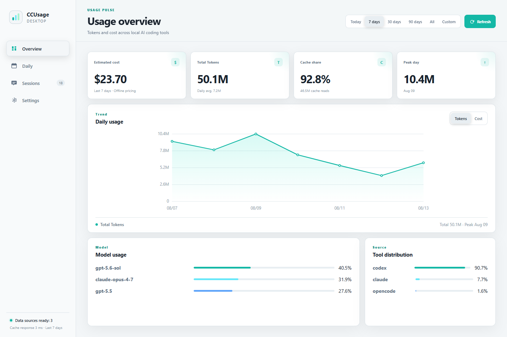

# CCUsage Desktop

English | [简体中文](README.zh-CN.md)

A local-first Windows desktop dashboard for [ccusage](https://github.com/ccusage/ccusage). It turns local AI coding usage logs into a clear view of Tokens, estimated cost, models, tools, projects, and sessions.

[Download the latest Windows release](https://github.com/Joe-Bao/ccusage-desktop/releases/latest)



> The screenshot uses built-in demo data. The desktop app reads your actual local usage data.

## Highlights

- Today, 7/30/90-day, all-time, and custom date ranges
- Daily Token and cost trends with precise hover/focus tooltips
- Per-day input, output, cache-read, total Token, cost, and range-share values
- Model and coding-tool distribution
- Codex session titles and projects, with search, sorting, and Token breakdowns
- English and Simplified Chinese, including system-language detection
- Responsive Windows UI with light/dark theme and display-scaling support
- Five-minute local result cache with stale-data fallback

## Install

1. Download `CCUsage Desktop_*_x64-setup.exe` from [Releases](https://github.com/Joe-Bao/ccusage-desktop/releases).
2. Run the installer.

The NSIS installer is per-user. Running a newer installer upgrades the existing installation in place and keeps application data.

> Builds are currently unsigned, so Windows SmartScreen may show a warning.

## Privacy and updates

Usage processing stays local:

- The bundled ccusage executable reads local usage files with offline pricing.
- No session, project, Token, or cost data is uploaded.
- No local web server is started by the installed desktop app.
- On startup, the app makes one anonymous request to GitHub's latest Release endpoint. It reads only the version tag and silently skips the check if GitHub is unavailable.

When a newer stable version exists, the app shows a dismissible notice that opens the Releases page. Downloads and installation remain user-controlled; there is no background auto-installer.

## Cache behavior

The app caches up to six date-range results in Tauri's application cache directory:

- A result newer than five minutes is returned without running ccusage.
- Missing or expired results run ccusage for the selected date range.
- There is no timed background scan.
- Refresh bypasses the cache.
- If a scan fails, an older cached result can remain visible with a warning.

ccusage scans supported local usage locations, not the whole Windows drive.

## Development

Requirements:

- Windows 10/11 with WebView2 Runtime
- Node.js 20+
- pnpm 10
- Rust stable with the MSVC target
- Visual Studio Build Tools with “Desktop development with C++”

```powershell
pnpm install
pnpm desktop:dev
```

`prepare:sidecar` copies the native Windows binary from ccusage's optional platform package. A global ccusage installation is not required.

## Verify and build

```powershell
# TypeScript, frontend build, Node/Rust tests, formatting, and Clippy
pnpm check

# Build the Windows NSIS installer
pnpm desktop:build
```

The installer is written to `src-tauri/target/release/bundle/nsis/`.

## Publishing a release

1. Update the version in `package.json`, `src-tauri/Cargo.toml`, and `src-tauri/tauri.conf.json`.
2. Run `pnpm check` and `pnpm desktop:build`.
3. Create a `vX.Y.Z` Git tag and a stable GitHub Release.
4. Upload the NSIS installer.

Drafts and prereleases are intentionally ignored by the in-app stable update check.

## Project layout

- `src/main.ts` — DOM rendering and interactions
- `src/data.ts` — ccusage JSON validation, statistics, and session aggregation
- `src/updates.ts` — GitHub Release lookup and version comparison
- `src-tauri/src/lib.rs` — sidecar execution, Codex metadata enrichment, and cache
- `scripts/prepare-sidecar.mjs` — native ccusage sidecar preparation
- `THIRD_PARTY_NOTICES.md` — bundled third-party notices

## License

ccusage is distributed under the MIT License; see [THIRD_PARTY_NOTICES.md](THIRD_PARTY_NOTICES.md). This repository does not currently declare a license for CCUsage Desktop itself.
